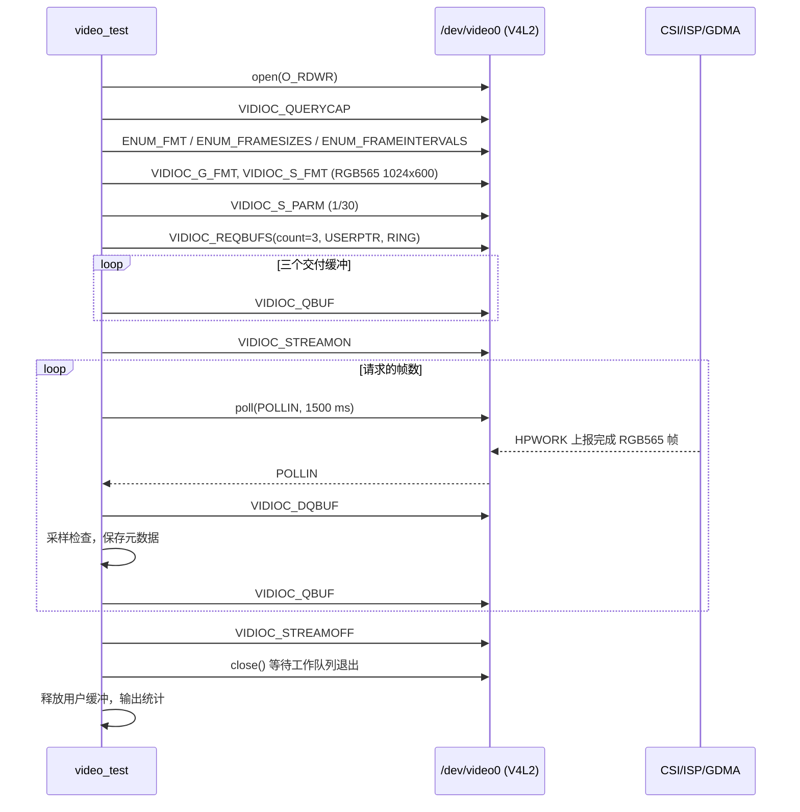

# ESP32-P4X `video_test` 最小连续取帧实现方案

> 状态（2026-09-10）：真实取帧与应用侧 30 fps 吞吐验收均已通过。`video_test`
> 连续交付 300 帧，`app_fps=30.02`、`sequence_gaps=0`。
> 问题闭环与证据见 [问题归档](2026-09-10-SC2336-video_test问题与解决方案.md)。
>
> 适用硬件：ESP32-P4 Function EV Board、SC2336 摄像头模组。
>
> 前置条件：`video` 配置已在真机注册 `/dev/video0`；设备固定输出
> `1024 × 600`、`RGB565`、`30 fps`。

## 1. 目的

`ls /dev` 中出现 `/dev/video0` 只证明板级 bring-up 已完成 V4L2 capture
设备注册，不能证明传感器、CSI、ISP、GDMA、帧完成回调和应用缓冲队列可用。

本阶段新增最小内建命令 `video_test`，只通过 NuttX 标准 V4L2 ioctl 连续取得
真实 RGB565 图像帧，将验收推进到：

```text
SC2336 → CSI Host → ISP RAW8/BGGR 转 RGB565 → GDMA 三缓冲
       → imgdata_s → V4L2 capture upper-half → /dev/video0 → video_test
```

它是数据通路验收程序，不是预览、录像、编码或文件保存应用。

## 2. 范围和边界

本期只实现以下能力：

- 打开既有的 `/dev/video0`，不调用 `capture_initialize()`，不重复注册设备；
- 查询、枚举并协商固定的 RGB565 格式；
- 申请 3 个用户态帧缓冲，执行 `QBUF → STREAMON → DQBUF → QBUF` 循环；
- 通过 `poll()` 等待完成帧，以有限超时定位无帧问题；
- 检查帧大小、顺序、内容统计和 V4L2 错误标志；
- 完成后依次 `STREAMOFF`、关闭设备等待工作队列退出，再释放缓冲并输出日志。

本期不包含：


- 显示到 `/dev/fb0`、JPEG 编码、文件写入、网络传输或图像算法；
- 以帧间 CRC 必须变化作为通过条件。静态场景、镜头盖住或曝光稳定时，连续帧可相同。

`csi_probe` 和 `/dev/video0` 都会占用唯一的 SC2336 与 CSI 接收资源。`video`
配置不得同时启用 `csi_probe`；运行 `video_test` 前也不得运行该诊断程序。

## 3. 命令行接口

```text
nsh> video_test
nsh> video_test 300
nsh> video_test 10 --full
```

| 参数 | 含义 | 默认值 | 范围 |
| --- | --- | ---: | ---: |
| `frames` | 要连续获取的帧数 | 100 | 1～1000 |
| `--full` | 全帧内容诊断，不作为吞吐验收 | 关闭 | 可选 |

首期设备路径固定为 `/dev/video0`，每一帧的等待上限为 1500 ms。超时值应覆盖
30 fps 的正常帧间隔、首次传感器启流和工作队列调度延迟，同时避免 NSH 无限阻塞。

吞吐模式每帧均匀检查 64 个 64 字节窗口，共 4 KiB；停止采集并关闭设备后，
再打印保存的元数据。`sample_crc32` 不代表整帧 CRC。`--full` 保留整帧检查。

至少 30 帧、首末 DQBUF 单调时钟计算的平均帧率为 28.5～31.5 fps，且序号缺口为
零时，才输出 `acceptance=30fps-app`；短测试和 `--full` 只验收内容。
以下为预期验收格式，并非最新附件中已出现的最终结果：

```text
video_test: app_fps=30.00 sequence_gaps=0 mode=throughput
video_test: PASS frames=300 acceptance=30fps-app
```

失败输出必须包含操作阶段和 errno，例如：

```text
video_test: FAIL step=VIDIOC_STREAMON errno=22
video_test: FAIL step=poll frame=3 errno=110
video_test: FAIL step=frame_size frame=3 actual=... expected=1228800
```

## 4. V4L2 调用顺序

应用不假设设备当前格式，先读取驱动实际声明的能力，再以该固定能力设置格式：



NuttX 的 capture upper-half 支持 `V4L2_MEMORY_USERPTR`。每个 `v4l2_buffer`
必须设置：

```c
buf.type = V4L2_BUF_TYPE_VIDEO_CAPTURE;
buf.memory = V4L2_MEMORY_USERPTR;
buf.index = index;
buf.m.userptr = (unsigned long)buffers[index];
buf.length = frame_bytes;
```

`VIDIOC_DQBUF` 在没有完成帧时会阻塞；因此程序先通过 `poll()` 加超时等待
`POLLIN`，再调用 `DQBUF`。这同时验证了 CSI 的完成中断、HPWORK 回调及
capture upper-half 的 `poll_notify()` 通路。

## 5. 格式与内存约束

板级私有 SC2336 驱动当前只向 V4L2 声明下列格式：

| 项目 | 值 |
| --- | --- |
| V4L2 像素格式 | `V4L2_PIX_FMT_RGB565` |
| 宽 × 高 | `1024 × 600` |
| 帧间隔 | `1/30` s |
| 单帧长度 | `1024 × 600 × 2 = 1,228,800` byte |
| 用户缓冲对齐 | 64 byte |
| V4L2 用户缓冲数量 | 3 |

用户缓冲用 `memalign(64, frame_bytes)` 分配。三块 V4L2 交付帧占
`3 × 1,228,800 = 3,686,400` byte，约 3.52 MiB。底层 CSI/ISP 已有三块
DMA 暂存帧，二者合计约 7.03 MiB；这要求 `video` 配置将缓冲分配到 PSRAM，
并为系统、LCD 与应用栈保留余量。

应用不能把同一块缓冲重复 `QBUF`，也不能在 `DQBUF` 后、再次 `QBUF` 前让
驱动继续使用该缓冲。每次 `DQBUF` 返回的 `index`、`m.userptr` 和 `length`
应原样用于重新 `QBUF`。

## 6. 帧有效性检查

`video_test` 不解析摄像头画面内容，但每个完成帧至少检查：

1. `V4L2_BUF_FLAG_ERROR` 未置位；
2. `bytesused` 精确等于 1,228,800 byte；
3. `sequence` 按 uint32_t 回绕语义向前递增；拒绝重复和倒退。内容模式允许缺口，吞吐验收要求缺口为零；
4. 默认对均匀选取的 4 KiB 窗口计算 CRC32，`--full` 检查整帧；
5. 样本不是全零，且存在至少两个不同的字节值。

第 5 项能识别常见的空数据、固定填充值和未更新缓冲问题，但不声称验证颜色或
图像几何。画质验收仍需后续 `video_preview` 或导出 RGB565 图像后检查 Bayer
顺序、RGB565 字节序、颜色、曝光和 ISP 调优。

连续帧通过的定义是：在指定帧数内，每帧均在超时前完成，长度与标志正确，且所有
帧均可重新入队。CRC 仅写入日志供比较；它不同可提供活动场景的辅助证据，但
相同不应导致测试失败。

## 7. 新增文件与构建接入

新增目录与文件：

```text
app/video_test/
├── CMakeLists.txt
├── Kconfig
├── Make.defs
├── Makefile
└── video_test_main.c
```

`Kconfig` 新增 `LVX_USE_DEMO_CONTEST2026_031_VIDEO_TEST`。它依赖
`ARCH_BOARD_ESP32P4_FUNCTION_EV_BOARD` 和
`ESP32P4_FUNCTION_EV_BOARD_CAMERA_SC2336_VIDEO`，不选择 CSI、ISP 或传感器
资源；这些资源由板级 `video` 配置统一选择，避免应用层绕过板级所有权。

`Make.defs` 与 `CMakeLists.txt` 沿用 `app/csi_probe` 的包注册形式，内建命令名为
`video_test`，建议栈大小为 4096 byte。`video` 的 `defconfig` 增加：

```text
CONFIG_LVX_USE_DEMO_CONTEST2026_031_VIDEO_TEST=y
```

应用只使用标准 V4L2 接口，不修改 `app/csi_probe`。后续性能验收暴露了上层首帧
序号重复及 `IMGDATA_SET_BUF` 返回类型问题，已通过
`drivers/nuttx/patches/0001-*.patch`、`0002-*.patch` 修复；迁移工作区时也需应用，
详见 [应用说明](../../../app/video_test/README.md)。

## 8. 实施与真机验收步骤

1. 从 `dev-ai-contest-2026` 创建功能分支，例如
   `feat/video-test-20260909`。
2. 新增应用目录、Kconfig、Make 与 CMake 接入，以及 `video_test_main.c`。
3. 在 `configs/video/defconfig` 启用应用；不启用 `csi_probe`。
4. 由开发者编译、烧录 `video` 配置，确认 NSH 中存在 `video_test` 和
   `/dev/video0`。
5. 运行 `video_test 10 --full` 验证内容，再运行 `video_test 300` 验证吞吐。
6. 改变镜头画面后再运行一次，记录 CRC 与样本统计变化，但不将 CRC 变化作为
   自动通过条件。
7. 连续多次启动、停止测试，确认第二次及之后的 `STREAMON` 仍能取帧，排除
   传感器 stream、CSI、GDMA 或 I2C 会话未释放的问题。

首轮验收记录至少应包含完整 NSH 输出、每帧 `sequence/bytesused/CRC`、失败时的
`errno` 和系统日志中的 CSI/ISP/GDMA 报错。若 `poll()` 超时，应先确认
`csi_probe raw 10` 的 RAW 基线，再从传感器启流、ISP 输出、GDMA 完成和 V4L2
回调四段收集状态，而不是直接修改应用缓冲策略。

### 8.1 已完成的首轮验收

在 ESP32-P4 rev 3.2、SC2336 `1024 × 600 RAW8 30 fps` 模组上，已完成：

```text
nsh> video_test
video_test: format=RGB565 1024x600 size=1228800 interval=1/30
video_test: frame=0 sequence=0  bytes=1228800 ... nonzero=yes nonconstant=yes
...
video_test: frame=9 sequence=73 bytes=1228800 ... nonzero=yes nonconstant=yes
video_test: PASS frames=10
```

这证明 SC2336、CSI Host、ISP、CSI Bridge、GDMA、芯片层三缓冲、V4L2 capture
upper-half 和 `video_test` 的端到端数据通路可用。各帧长度均为 1,228,800 byte，
且 CRC 与内容统计均变化，排除空缓冲和固定填充值。

## 9. 首帧超时问题与解决方案

### 9.1 现象与定位

最初 `video_test` 在 `VIDIOC_STREAMON` 后执行 `poll()`，第一帧等待 1,500 ms 后
返回 `errno=110`。当时 SC2336 已完成 SCCB 初始化并启流，CSI Host 没有 PHY、包或
CRC 错误，ISP 已出现帧头、帧尾和 RAW 到 RGB 处理事件；但 GDMA 的目的地址偏移为
零，未完成任何 64-bit 传输。故障被收敛到 ISP 输出至 CSI Bridge、再至 GDMA 的
链路，而不是 V4L2 队列或传感器输入。

诊断还显示 Bridge 的 `vadr_num_gt_real` 状态。将 RGB565 分支的 Bridge 行配置从
600 对齐到 ISP 的末行索引 599 后，该状态仍存在且 GDMA 仍不传输，说明行索引差异
不是唯一根因，不能单独作为修复结论。

### 9.2 根因与修复

板端诊断确认芯片 revision 为 3.2，构建的最小硬件版本为 3.1，Bridge 色彩转换
寄存器真实可用。CSI Bridge 原先只允许传感器 RAW8 数据类型 `0x2a`，但 ISP 输出
RGB565 数据面不能以该单一过滤条件处理。Bridge 因此没有向 GDMA 交付有效数据。

芯片层采用以下配置组合：

1. 保留 RGB565 路径已有的 `height - 1` 配置（599），RAW 诊断路径保留原有行数。
   寄存器数值相同不单独证明 ISP 与 Bridge 采用相同计数语义。
2. Bridge 数据类型过滤使用 Espressif CSI HAL 的标准范围 `0x12` 至 `0x2f`，不再固定
   为传感器的 `0x2a`。
3. 保持 ISP 执行 RAW8/BGGR 至 RGB565 转换，Bridge 负责转发至 GDMA；不修改
   `v4l2_cap.c`。
4. 保留 chip revision、Bridge 数据类型、DMA 请求和块大小日志，便于不同 P4 revision
   的后续定位。

`bridge_rows=599` 的单独验证未恢复取帧；扩大数据类型范围后端到端测试立即通过。
因此扩大数据类型过滤范围是恢复取帧的决定性改动；599 配置目前保留，但其必要性
没有独立 A/B 证据。此前“低于 v3、色彩转换接口为空实现”的假设已被 rev 3.2 日志排除。

### 9.3 性能问题及最新边界

旧测试每帧同步扫描完整 1.2 MiB、计算 CRC 并打印后才 QBUF，首轮 10 帧应用速率
约 3.7 fps，序号从 0 增至 73。不能据此直接认定传感器无丢帧或芯片层无目标丢弃：
V4L2 sequence 统计上层交付，RING 模式允许覆盖尚未被应用取走的完成帧。
`complete_capture()` 会立即设置下一块目标缓冲，不需要等当前应用缓冲重新 QBUF。

已改为 4 KiB 采样、立即 QBUF、结束后输出日志，并增加交付/丢弃/复制耗时统计。
轻量模式暴露的首两帧 sequence=0 问题，也已通过在完成回调中统一编号解决。

最新用户日志已完成 300 帧汇总：

```text
video_test: app_fps=30.02 sequence_gaps=0 mode=throughput
video_test: PASS frames=300 acceptance=30fps-app
```

这证明应用连续交付速率达到 30 fps，且所有已交付帧的 V4L2 sequence 连续；当前
`video_test` 的 30 fps 应用侧验收已通过。`copy_avg_us` 等复制耗时若受时钟粒度
限制，仍不能作为精确的 CPU 占用率或单帧延迟结论。

原始日志及分问题验证记录见 [问题归档](2026-09-10-SC2336-video_test问题与解决方案.md)。

## 10. 后续演进

`video_test` 通过后，可在不改变驱动接口的前提下逐步新增：

- `video_preview`：将 DQBUF 的 RGB565 帧复制或转换后显示到 `/dev/fb0`；
- RGB565 原始帧导出和离线画质检查；
- 以 QBUF/DQBUF 为基础的算法消费者；
- ISP 色彩与镜头调优；
- 多应用访问、帧率统计、丢帧和内存压力测试。

这些功能均应建立在 `video_test` 连续取帧稳定通过的基础上。
