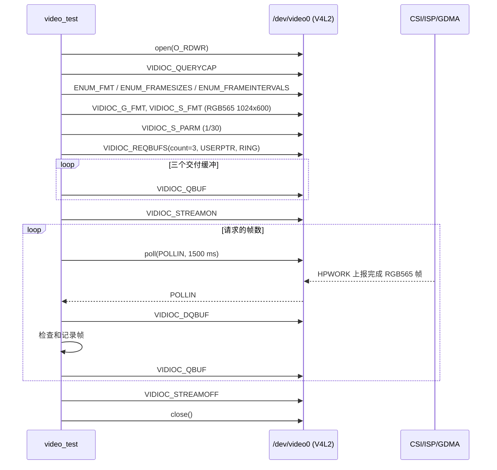

# ESP32-P4X `video_test` 最小连续取帧实现方案

> 状态：已实现，待编译与真机验收
>
> 适用硬件：ESP32-P4 Function EV Board、SC2336 摄像头模组。
>
> 前置条件：`video` 配置已在真机注册 `/dev/video0`；设备固定输出
> `1024 × 600`、`RGB565`、`30 fps`。

## 1. 目的

`ls /dev` 中出现 `/dev/video0` 只证明板级 bring-up 已完成 V4L2 capture
设备注册，不能证明传感器、CSI、ISP、GDMA、帧完成回调和应用缓冲队列可用。

本阶段新增最小内建命令 `video_test`，只通过 NuttX 标准 V4L2 ioctl 连续取得
真实 RGB565 图像帧，将验收推进到：

```text
SC2336 → CSI Host → ISP RAW8/BGGR 转 RGB565 → GDMA 三缓冲
       → imgdata_s → V4L2 capture upper-half → /dev/video0 → video_test
```

它是数据通路验收程序，不是预览、录像、编码或文件保存应用。

## 2. 范围和边界

本期只实现以下能力：

- 打开既有的 `/dev/video0`，不调用 `capture_initialize()`，不重复注册设备；
- 查询、枚举并协商固定的 RGB565 格式；
- 申请 3 个用户态帧缓冲，执行 `QBUF → STREAMON → DQBUF → QBUF` 循环；
- 通过 `poll()` 等待完成帧，以有限超时定位无帧问题；
- 检查帧大小、顺序、内容统计和 V4L2 错误标志；
- 完成后可靠地 `STREAMOFF`、释放缓冲并关闭设备。

本期不包含：

- 修改 `nuttx/drivers/video/v4l2_cap.c` 或 V4L2 公共头文件；
- 修改 CSI、ISP、GDMA 三缓冲或 SC2336 板级驱动；
- 显示到 `/dev/fb0`、JPEG 编码、文件写入、网络传输或图像算法；
- 以帧间 CRC 必须变化作为通过条件。静态场景、镜头盖住或曝光稳定时，连续帧可相同。

`csi_probe` 和 `/dev/video0` 都会占用唯一的 SC2336 与 CSI 接收资源。`video`
配置不得同时启用 `csi_probe`；运行 `video_test` 前也不得运行该诊断程序。

## 3. 命令行接口

```text
nsh> video_test
nsh> video_test 30
```

| 参数 | 含义 | 默认值 | 范围 |
| --- | --- | ---: | ---: |
| `frames` | 要连续获取的帧数 | 10 | 1～100 |

首期设备路径固定为 `/dev/video0`，每一帧的等待上限为 1500 ms。超时值应覆盖
30 fps 的正常帧间隔、首次传感器启流和工作队列调度延迟，同时避免 NSH 无限阻塞。

成功输出建议采用固定、可检索的格式：

```text
video_test: device=/dev/video0 driver=SC2336
video_test: format=RGB565 1024x600 size=1228800 interval=1/30
video_test: frame=0 sequence=0 bytes=1228800 timestamp=... \
            sample_crc32=0x........ nonzero=yes nonconstant=yes
...
video_test: PASS frames=10
```

失败输出必须包含操作阶段和 errno，例如：

```text
video_test: FAIL step=VIDIOC_STREAMON errno=22
video_test: FAIL step=poll frame=3 errno=110
video_test: FAIL step=frame_size frame=3 actual=... expected=1228800
```

## 4. V4L2 调用顺序

应用不假设设备当前格式，先读取驱动实际声明的能力，再以该固定能力设置格式：



NuttX 的 capture upper-half 支持 `V4L2_MEMORY_USERPTR`。每个 `v4l2_buffer`
必须设置：

```c
buf.type = V4L2_BUF_TYPE_VIDEO_CAPTURE;
buf.memory = V4L2_MEMORY_USERPTR;
buf.index = index;
buf.m.userptr = (unsigned long)buffers[index];
buf.length = frame_bytes;
```

`VIDIOC_DQBUF` 在没有完成帧时会阻塞；因此程序先通过 `poll()` 加超时等待
`POLLIN`，再调用 `DQBUF`。这同时验证了 CSI 的完成中断、HPWORK 回调及
capture upper-half 的 `poll_notify()` 通路。

## 5. 格式与内存约束

板级私有 SC2336 驱动当前只向 V4L2 声明下列格式：

| 项目 | 值 |
| --- | --- |
| V4L2 像素格式 | `V4L2_PIX_FMT_RGB565` |
| 宽 × 高 | `1024 × 600` |
| 帧间隔 | `1/30` s |
| 单帧长度 | `1024 × 600 × 2 = 1,228,800` byte |
| 用户缓冲对齐 | 64 byte |
| V4L2 用户缓冲数量 | 3 |

用户缓冲用 `memalign(64, frame_bytes)` 分配。三块 V4L2 交付帧占
`3 × 1,228,800 = 3,686,400` byte，约 3.52 MiB。底层 CSI/ISP 已有三块
DMA 暂存帧，二者合计约 7.03 MiB；这要求 `video` 配置将缓冲分配到 PSRAM，
并为系统、LCD 与应用栈保留余量。

应用不能把同一块缓冲重复 `QBUF`，也不能在 `DQBUF` 后、再次 `QBUF` 前让
驱动继续使用该缓冲。每次 `DQBUF` 返回的 `index`、`m.userptr` 和 `length`
应原样用于重新 `QBUF`。

## 6. 帧有效性检查

`video_test` 不解析摄像头画面内容，但每个完成帧至少检查：

1. `V4L2_BUF_FLAG_ERROR` 未置位；
2. `bytesused` 精确等于 1,228,800 byte；
3. `sequence` 递增；首帧序号可以是零或由驱动定义的起始值；
4. 对整帧或固定步长样本计算 CRC32；
5. 样本不是全零，且存在至少两个不同的字节值。

第 5 项能识别常见的空数据、固定填充值和未更新缓冲问题，但不声称验证颜色或
图像几何。画质验收仍需后续 `video_preview` 或导出 RGB565 图像后检查 Bayer
顺序、RGB565 字节序、颜色、曝光和 ISP 调优。

连续帧通过的定义是：在指定帧数内，每帧均在超时前完成，长度与标志正确，且所有
帧均可重新入队。CRC 仅写入日志供比较；它不同可提供活动场景的辅助证据，但
相同不应导致测试失败。

## 7. 新增文件与构建接入

新增目录与文件：

```text
app/video_test/
├── CMakeLists.txt
├── Kconfig
├── Make.defs
├── Makefile
└── video_test_main.c
```

`Kconfig` 新增 `LVX_USE_DEMO_CONTEST2026_031_VIDEO_TEST`。它依赖
`ARCH_BOARD_ESP32P4_FUNCTION_EV_BOARD` 和
`ESP32P4_FUNCTION_EV_BOARD_CAMERA_SC2336_VIDEO`，不选择 CSI、ISP 或传感器
资源；这些资源由板级 `video` 配置统一选择，避免应用层绕过板级所有权。

`Make.defs` 与 `CMakeLists.txt` 沿用 `app/csi_probe` 的包注册形式，内建命令名为
`video_test`，建议栈大小为 4096 byte。`video` 的 `defconfig` 增加：

```text
CONFIG_LVX_USE_DEMO_CONTEST2026_031_VIDEO_TEST=y
```

不修改 `app/csi_probe`，也不需要修改 `v4l2_cap.c`、`esp_mipi_csi.c`、
`esp_mipi_csi_video.c` 或 `esp32p4_camera.c`。

## 8. 实施与真机验收步骤

1. 从 `dev-ai-contest-2026` 创建功能分支，例如
   `feat/video-test-20260909`。
2. 新增应用目录、Kconfig、Make 与 CMake 接入，以及 `video_test_main.c`。
3. 在 `configs/video/defconfig` 启用应用；不启用 `csi_probe`。
4. 由开发者编译、烧录 `video` 配置，确认 NSH 中存在 `video_test` 和
   `/dev/video0`。
5. 运行 `video_test`，再运行 `video_test 30`。
6. 改变镜头画面后再运行一次，记录 CRC 与样本统计变化，但不将 CRC 变化作为
   自动通过条件。
7. 连续多次启动、停止测试，确认第二次及之后的 `STREAMON` 仍能取帧，排除
   传感器 stream、CSI、GDMA 或 I2C 会话未释放的问题。

首轮验收记录至少应包含完整 NSH 输出、每帧 `sequence/bytesused/CRC`、失败时的
`errno` 和系统日志中的 CSI/ISP/GDMA 报错。若 `poll()` 超时，应先确认
`csi_probe raw 10` 的 RAW 基线，再从传感器启流、ISP 输出、GDMA 完成和 V4L2
回调四段收集状态，而不是直接修改应用缓冲策略。

## 9. 后续演进

`video_test` 通过后，可在不改变驱动接口的前提下逐步新增：

- `video_preview`：将 DQBUF 的 RGB565 帧复制或转换后显示到 `/dev/fb0`；
- RGB565 原始帧导出和离线画质检查；
- 以 QBUF/DQBUF 为基础的算法消费者；
- ISP 色彩与镜头调优；
- 多应用访问、帧率统计、丢帧和内存压力测试。

这些功能均应建立在 `video_test` 连续取帧稳定通过的基础上。
