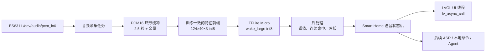

# ESP32-P4X Smart Home `wake_large` 唤醒词模型接入方案

> 状态：方案阶段；已完成模型资产检查，尚未开始端侧移植、构建或真机推理。
>
> 目标硬件：ESP32-P4 Function EV Board、ES8311 麦克风、OpenVela/NuttX。
>
> 模型来源：本机开发资产目录 `~/Documents/C/wake_large/`。模型及训练产物在
> 权属、版本和可复现性确认前不得直接作为公开仓库二进制资源提交。

## 1. 目标与范围

将 `wake_large` 作为 Smart Home 的**离线常驻唤醒词检测器**。命中后仅改变本地
语音状态：显示唤醒反馈、开始有限时长的语音会话或开放后续命令词/ASR 输入；模型
不直接调用云端 LLM，不产生 token 消耗。

首期范围：

```text
ES8311 ADC → 16 kHz PCM16 mono → 特征提取 → int8 KWS 推理
         → 置信度/连续命中/冷却 → Smart Home 本地唤醒事件 → LVGL 提示
```

首期不包含：

- 常开全双工播放时的 AEC、降噪、波束成形与声源定位；
- “唤醒后说什么”的云端 ASR、TTS 协议实现；
- 将音频连续上传到网络或交给 cAGENT；
- 以离线验证集精度代替真实房间的误唤醒率结论；
- 修改 P4 通用 I2S、GDMA 或第三方 HAL 源码。

## 2. 模型资产盘点

`wake_large` 目录包含以下可用资产：

| 文件 | 用途 | 当前结论 |
| --- | --- | --- |
| `model_int8.tflite` | 首选端侧模型 | 约 40 KB，int8。 |
| `model_float.tflite` | PC/参考对比模型 | 约 76 KB，不作为首版固件模型。 |
| `model.cc`、`model.h` | 内嵌模型数组 | `g_s3_model` 16-byte 对齐，长度 37,408 byte。 |
| `metadata.json`、`labels.txt` | 输入及标签契约 | 可作为端侧配置的来源，但信息不完整。 |
| `metrics_tflite_int8.json`、`threshold_sweep.json` | 离线结果与阈值候选 | 用于初始参数，不是实机验收证据。 |
| `wake_large_deploy.tar.gz` | 部署资产归档 | 需要解包核对是否含前端代码、测试样本和许可证。 |

### 2.1 已确认的模型契约

| 项目 | 值 |
| --- | --- |
| 架构 | `ds_cnn_s3`（深度可分离 CNN） |
| 参数量 | 18,277 |
| 量化 | int8 |
| 采样率 | 16,000 Hz |
| 输入音频片段 | 2,500 ms |
| 帧长 / 帧移 | 30 ms / 20 ms |
| 特征维度 | `124 × 40 × 3` |
| 输入名称 | `input_features` |
| 输出名称 | `output_0` |
| 类别 | `wake`、`hard_neg`、`other_speech`、`background`、`silence` |
| 事件类别 | `wake`（索引 0） |
| 元数据推荐阈值 | 0.75 |

30 ms 对应 480 个采样点，20 ms 帧移对应 320 个采样点。输入窗口长度为
2.5 秒，即 40,000 个 PCM16 采样点、约 80 KB；常驻实现应采用环形缓冲，不能把
该数组放入任务栈。

### 2.2 离线指标的正确解释

int8 测试集报告的 accuracy 为约 99.59%；`wake` 类的 precision 为约 99.76%，
recall 为约 99.90%。在保存的阈值扫描中，阈值 0.75 的 `wake` 结果是：

```text
TP = 2904, FP = 1, FN = 10
precision = 99.97%, recall = 99.66%
```

这些数字只能证明给定离线测试集上的分类表现，**不能推导每小时误唤醒次数**。测试
切片可能相互相关，也不包含本板扬声器回声、真实房间混响、电视人声及连续背景噪声。
阈值 0.75 因而是首轮起点，不是固化产品参数。

## 3. 最大前置条件：前端必须逐值复现

模型输入是 `124 × 40 × 3` 的 int8 特征，而不是裸 PCM。当前 metadata 未说明以下
决定模型可用性的参数：

- FFT 长度、FFT 实现和幅度归一化；
- Mel filterbank 的低/高截止频率、scale 与 bin 分布；
- 对数变换的底数、epsilon、能量单位与归一化/标准化常数；
- 最后一维 `3` 的含义和排列顺序（例如静态特征、Delta、Delta-Delta，或相邻帧堆叠）；
- TFLite 输入/输出张量的量化 `scale` 和 `zero_point`；
- 训练数据的端点对齐、静音填充和滑窗触发策略。

缺失任一项都可能让模型“可运行但始终不命中”或误唤醒严重。因此不能依据
`feature_bins=40` 自行实现一个通用 MFCC/Mel 前端后就开始调阈值。

### 3.1 必须取得的金标准资产

在编写端侧前端前，从模型训练工程或 `wake_large_deploy.tar.gz` 中确认并固化：

1. 产生 `124×40×3` 特征的源码与全部常数；
2. 至少 3 组固定 PCM16 输入、其 float 特征、量化 int8 输入和预期五类输出分数；
3. `model_int8.tflite` 的 SHA-256、训练数据版本、许可证和唤醒短语定义；
4. TFLite tensor 的 shape、type、quantization 参数和模型算子列表。

端侧实现要对同一 PCM 逐元素比较特征与量化输入；在误差门限未定义且对拍未通过前，
不得解释任何实机唤醒率数据。

## 4. 与当前 Smart Home 的集成架构



### 4.1 线程与资源所有权

| 模块 | 所在线程 | 禁止事项 |
| --- | --- | --- |
| 音频采集 | 独立高优先级任务 | 不操作 LVGL，不调用网络/Agent。 |
| 特征与推理 | 采集任务或专用 KWS 任务 | 不做阻塞文件 I/O，不在 ISR 内执行。 |
| 后处理状态机 | KWS 任务 | 不直接修改 LVGL 控件。 |
| UI 提示 | LVGL 所属 UI 线程 | 不读取正在被 DMA 写入的 PCM 缓冲。 |
| Agent/ASR | 独立 worker | 不重新打开或抢占 `/dev/audio/pcm_in0`。 |

KWS、PTT 录音和后续 ASR 必须共享一个麦克风所有者。推荐由语音服务持续接收 DMA
音频并写入有界环形缓冲，再按状态机向 KWS、录音会话提供逻辑数据；禁止两个应用
同时打开 `/dev/audio/pcm_in0`。

### 4.2 唤醒后的状态机

```text
IDLE_LISTEN
  └─ wake 命中 → WAKE_CONFIRMED（UI 提示、记录时间）
                     └─ 可选提示音播放完成 → CAPTURE_COMMAND
                                                   └─ 超时/取消 → IDLE_LISTEN
```

首版在 `WAKE_CONFIRMED` 中仅显示 UI 提示和写入日志；等录音、ASR 或本地命令词
各自通过验收后，再接入 `CAPTURE_COMMAND`。播放提示音与持续监听先采用互斥模式，
避免扬声器声音被麦克风回采而导致自唤醒。

## 5. 运行时和模型打包选择

### 5.1 推理运行时

仓库已有 `apps/mlearning/tflite-micro`。它可以作为 P4 的首选运行时，但当前
`CONFIG_TFLITEMICRO_ESP_NN` 仅依赖 ESP32-S3；P4 首轮使用通用 TFLite Micro
reference kernel。不得将 S3 的 ESP-NN 性能或配置照搬到 P4。

在首次集成前，通过独立 `kws_smoke` 应用验证：模型 FlatBuffer 可解析、所需算子
均被 `MicroMutableOpResolver` 注册、`AllocateTensors()` 成功、tensor arena 峰值
与单帧 invoke 的均值/P95 可记录。

### 5.2 模型存放

首版推荐将已核准的 `model.cc` 改名为项目命名空间下的只读数组并链接入固件：

```text
demos/smart_home/src/voice/models/wake_large_int8_model.cc
demos/smart_home/src/voice/models/wake_large_int8_model.h
```

优点是启动无文件系统依赖、数组已 16-byte 对齐、模型仅约 37 KB。模型升级后再评估
LittleFS 外置 `.tflite`，并增加 hash、版本、回滚和加载失败处理。无论哪种方式，
均须保留 metadata、labels、模型版本和训练前端版本的对应关系。

## 6. 建议的后处理参数

初始策略如下，最终由实机数据确定：

| 参数 | 初始值 | 目的 |
| --- | ---: | --- |
| 单帧 `wake` 阈值 | 0.75 | 沿用训练侧推荐起点。 |
| 连续命中次数 | 2～3 | 抑制一次性噪声尖峰。 |
| 推理步长 | 20 ms | 与训练帧移一致；可在性能不足时评估更低频率。 |
| 触发冷却时间 | 1.5～2 s | 防止同一句语音重复触发。 |
| 触发前置静音/语音门 | 首版关闭 | 先避免增加未验证前端；后续基于 RMS/VAD 加入。 |

每一次触发都应记录模型版本、`wake` 分数、次高类别与分数、连续命中数、推理耗时、
时间戳和冷却状态。日志不要记录原始语音内容，除非用户明确开启调试录音。

## 7. 分阶段实施与验收

| 阶段 | 工作 | 通过条件 |
| --- | --- | --- |
| K0：音频基线 | 完成 ES8311 `audio_smoke record`，导出并分析 16 kHz mono PCM16。 | 人声可辨；无长静音、严重削波、周期 DMA 失真或录音节点阻塞。 |
| K1：模型契约 | 解包部署档案、取得训练前端源码、金标准向量与量化参数。 | 可复现地得到与训练侧一致的 feature/input/output。 |
| K2：离线对拍 | 移植前端，在主机与目标端分别运行固定 PCM。 | 特征、量化输入和输出类别/分数符合预先定义的误差范围。 |
| K3：`kws_smoke` | 在 P4 用 TFLM 加载 int8 模型，打印一次/连续推理耗时及 arena。 | `AllocateTensors` 和 invoke 均成功；P95 推理加前端低于 20 ms，或给出可接受调度策略。 |
| K4：Smart Home 状态机 | 替换语音桩中的 KWS 部分，接入 UI 唤醒反馈和冷却状态。 | 唤醒仅触发本地状态；UI 不阻塞、不跨线程访问。 |
| K5：真实环境评估 | 不同距离、说话人、房间噪声、电视声与扬声器播放下长时间测试。 | 给出漏唤醒、误唤醒、触发延迟和资源占用，而非只报告离线 accuracy。 |

### 7.1 K0 的 PCM 质量检查

真实麦克风采样的格式必须明确为：16,000 Hz、单声道、signed PCM16 little-endian。
导出的样本使用项目 `pcm-audio` 工具检查：

```sh
python .claude/skills/pcm-audio/scripts/audio_analyzer.py recording.pcm \
  --sample-rate 16000 --channels 1
```

重点记录削波比例、长静音段、爆音、底噪和周期性失真。KWS 命中率下降时，先检查
这份 PCM 与训练域的差异，不应直接修改阈值掩盖录音问题。

## 8. 建议代码边界

```text
demos/smart_home/src/voice/
├── smart_home_voice.c             # 语音服务状态机、唯一麦克风所有者
├── smart_home_voice_capture.c     # Audio API 收包、PCM 环形缓冲
├── smart_home_voice_frontend.c    # 训练一致的特征前端
├── smart_home_voice_kws.cc        # TFLM interpreter、arena、模型调用
├── smart_home_voice_post.c        # 阈值、连续命中、冷却与事件发布
├── smart_home_voice.h             # 对 UI/Agent 暴露的稳定接口
└── models/
    └── wake_large_int8_model.cc/.h

app/kws_smoke/
├── Kconfig
├── CMakeLists.txt
├── Make.defs
├── Makefile
└── kws_smoke_main.c                # 先于 Smart Home 集成的模型/性能验收
```

`kws_smoke` 只做模型、前端对拍和性能验证；它不链接 LVGL、cAGENT 或网络。只有 K3
通过后，才将相同的 library 代码接入 `demos/smart_home`。

## 9. 真机验收指标

K5 报告至少包含：

- 模型 SHA-256、训练前端版本、固件 commit、阈值和连续命中参数；
- 采样率、帧长、帧移、输入 tensor shape/type/quantization 与 tensor arena 大小；
- 特征提取、推理与总时延的平均值、P95、最大值；
- 每小时误唤醒数、唤醒成功率、端到端 UI 提示延迟；
- 不同距离、不同说话人、静音、背景音乐、电视人声和设备扬声器播放下的分项结果；
- 与摄像头预览、网络 Agent 同时运行时的 PCM 丢帧、KWS deadline missed、堆和 PSRAM 统计。

推荐首轮测试矩阵：1 m/3 m 两个距离；至少 3 名说话人；安静、风扇、电视人声三个
背景；每一组合分别进行 50 次正样本与不少于 30 分钟负样本监听。通过门限由实际产品
目标确定；在获得该目标前，不宣称“已稳定量产可用”。

## 10. 风险与处置

| 现象 | 首先检查 | 不应直接采取的做法 |
| --- | --- | --- |
| 模型运行但从不命中 | 前端/量化参数与金标准对拍 | 盲目降低阈值。 |
| 误唤醒高 | 负样本、连续命中、冷却、真实麦克风底噪 | 仅提高单帧阈值。 |
| 推理超时 | P95 分解、arena 位置、算子 profile | 未测量便替换模型。 |
| 与播放时自唤醒 | 音频互斥状态、扬声器回采 | 把问题归因于模型训练。 |
| 与显示/摄像头共存丢帧 | 任务优先级、DMA/PSRAM 带宽 | 在 LVGL 线程做推理。 |
| Agent 忙时没有响应 | 本地状态机和 `AGENT_ERROR_BUSY` 提示 | 静默丢弃唤醒后的请求。 |

## 11. 关联资料

- [端侧 KWS 接入方案（通用架构）](ESP32-P4X-端侧KWS方案.md)
- [ES8311 麦克风与扬声器适配方案](../../硬件适配/ESP32-P4X-Function-EV-Board-ES8311音频适配方案.md)
- [ES8311 Codec 适配与 GDMA 问题复盘](../../开发日志/ESP32-P4X-ES8311-Codec适配与GDMA问题复盘.md)
- [智能家居中枢摄像头实时预览接入方案](ESP32-P4X-SmartHome摄像头实时预览接入方案.md)
