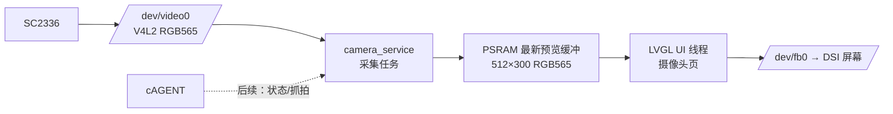

# ESP32-P4X Smart Home 安防页摄像头实时预览接入方案

> 状态：C1/C2 已开始实现，等待 `smart_home` 配置真机验证；本文以 2026-09-18 的 LVGL 安防页为 UI 基线。
>
> 适用硬件：ESP32-P4 Function EV Board、SC2336 摄像头、EK79007
> 1024×600 MIPI-DSI 屏幕。
>
> 前置基线：`video` 配置已在真机完成 `/dev/video0` 连续 300 帧取帧，应用侧
> 实测约 30 fps、无 sequence gap。Smart Home 已能在 `/dev/fb0` 上运行 LVGL UI。

## 1. 目标与边界

在 Smart Home 中枢增加**本地实时摄像头预览**：安防页的“客厅 · 实时预览”区域显示
SC2336 的持续画面；用户可继续在安防、聊天、设备和设置页面间切换。首期不改变安防页
既有的告警卡片和底部导航布局。

“进入监控”在首期只负责启动/停止安防页内的预览。独立全屏监控页属于后续增强：它必须
复用同一个 `camera_service`，不能重新打开 `/dev/video0`。

首版摄像头默认关闭；用户通过安防页页脚的开关或“进入监控”显式启用。离开安防页时
停止采集并释放 `/dev/video0`、CSI/ISP 工作链路和应用侧 PSRAM 缓冲，避免隐私与资源
占用问题。

首期目标是可靠预览，不将所有视觉能力一次性叠加进来：

| 首期包含 | 首期不包含 |
| --- | --- |
| 本地 LVGL 摄像头预览 | JPEG/H.264 编码、录像、网络直播 |
| `/dev/video0` 的 V4L2 采集、帧率与错误统计 | 将 30 fps 原始帧上传给 Agent 或云端 |
| 安防页内嵌预览与“进入监控”开关 | 独立全屏监控页、端侧检测、人脸/目标识别 |
| 页面进入/退出后的可靠启停 | 摄像头后台常开和多消费者并行使用 |

Agent 集成属于后续阶段，只提供低频的 `get_camera_status`、
`take_camera_snapshot` 一类能力；它不直接持有或传输实时帧。

## 2. 现有能力与路径选择

仓库中有两份不同时期的摄像头资料，使用时必须区分：

| 路径 | 当前定位 | 是否用于 Smart Home 预览 |
| --- | --- | --- |
| `csi_probe` + 板级 `esp_mipi_csi_*` | RAW8/BGGR 底层诊断，单帧或有限帧采集 | 否，仅用于 CSI 故障回归 |
| `video` + `/dev/video0` | CSI/ISP/GDMA/V4L2 视频采集，RGB565、1024×600、30 fps | 是，唯一的应用采集入口 |

因此，Smart Home **不能**直接复用旧 RAW 指南中的 `board_sc2336_csi_*()` 和
`esp_mipi_csi_*()` 调用。它应作为一个普通 V4L2 应用打开 `/dev/video0`，从而与
传感器配置、ISP 输出、GDMA 和 V4L2 upper-half 解耦。

当前视频数据链路为：

```text
SC2336 RAW8/BGGR
  → P4 MIPI-CSI Host
  → ISP（转 RGB565）
  → GDMA / 底层三缓冲
  → imgdata + V4L2 capture upper-half
  → /dev/video0（RGB565，1024×600，30 fps）
  → Smart Home camera_service
  → 最新预览帧缓存
  → LVGL 安防页预览区域
```

相机和屏幕同为 1024×600、RGB565，因此预览没有 Bayer 去马赛克或颜色空间转换的
需求；首版仅需做安全的缓存复制与缩小。

## 3. 总体架构与线程边界



### 3.1 `camera_service` 的职责

新增独立服务，独占 `/dev/video0`，负责：

1. 打开设备、查询能力、协商固定的 `RGB565 / 1024×600 / 30 fps`；
2. 分配三个 64-byte 对齐的 `V4L2_MEMORY_USERPTR` 全尺寸缓冲；
3. 执行 `QBUF × 3 → STREAMON → poll → DQBUF → QBUF` 循环；
4. 将已完成帧缩放/复制到服务私有的预览缓冲，并更新帧序号、采集 fps、丢帧数和最近错误；
5. 在 UI 请求停止时完成 `STREAMOFF → close → 等待任务退出 → 释放缓冲`；
6. 向 UI 提供只读的最新帧快照与状态查询接口。

建议接口如下，具体命名可随实现调整：

```c
int smart_home_camera_start(void);
int smart_home_camera_stop(void);
int smart_home_camera_get_status(struct smart_home_camera_status_s *status);
int smart_home_camera_copy_latest(uint16_t *dst, size_t dst_bytes,
                                  uint32_t *sequence);
```

服务模块不依赖 LVGL、cAGENT、网络和具体页面，便于独立 NSH/单元测试。

### 3.2 LVGL 的职责

LVGL 页面只在 UI 所在线程中进行以下工作：

- 在 `smart_home_lvgl_build_security_screen()` 中创建固定大小的预览图像对象、状态文字与
  “进入监控”控件；
- 以约 66 ms 的 `lv_timer` 轮询最新帧序号，UI 预览上限为 **15 FPS**；
- 当序号变化时，将服务数据复制到 UI 持有的图像缓存，更新图像 source 并失效对象；
- 进入安防页或点击“进入监控”时调用 `smart_home_camera_start()`；离开安防页或手动停止时
  调用 `smart_home_camera_stop()`；
- 失败时保留 UI，显示具体错误码和“重试”入口。

**禁止规则：**采集任务、V4L2 回调、ISR 和 Agent worker 都不得调用 LVGL API。
LVGL 对象的创建、删除、图片 source 更新和 `invalidate` 必须只发生在 UI 线程。

### 3.3 缓冲所有权规则

`VIDIOC_DQBUF` 后的 USERPTR 缓冲仍由采集服务暂时拥有。首版必须按下列顺序处理：

```text
poll() 成功
  → DQBUF 取得 index
  → 在采集任务内缩小/复制到私有 preview buffer
  → QBUF 原始 1024×600 缓冲给 V4L2
  → 发布 preview_sequence
  → UI 下一次 timer 更新图像
```

不能把 `DQBUF` 的原始指针直接传给 LVGL，也不能在 LVGL 绘制期间将该缓冲 `QBUF`。
否则驱动 DMA 覆写中的图像会造成撕裂、花屏，甚至耗尽 V4L2 队列而停流。

首版选择“复制后立即归还”而不选择零拷贝。零拷贝需要显示与 V4L2 队列之间的帧租约、
VSync 同步和严格的 buffer fence，适合后续全屏高帧率优化，不能作为第一版的前提。

## 4. 性能与内存预算

### 4.1 帧率策略

相机侧保持 30 fps；首版 UI 预览目标为 **15 fps**。服务只对每两个源帧执行一次缩放，
避免 30 次每秒的大图刷新抢占 LVGL、DSI、触摸、Wi-Fi 与 Agent。

首版预览尺寸为 512×300 RGB565，适配安防页左侧卡片；采用整数最近邻抽样：

```text
1024×600 RGB565  -- 最近邻缩小 -->  512×300 RGB565
```

实现不使用浮点运算；后续可按 UI 卡片大小采用 320×188 缩略图，但不能在采集路径中
执行昂贵的通用缩放算法。

### 4.2 常驻内存

| 项目 | 估算 |
| --- | ---: |
| V4L2 用户态 3 帧 | `3 × 1024 × 600 × 2` = 3.52 MiB |
| CSI/ISP/GDMA 底层三缓冲 | 约 3.52 MiB |
| 512×300 服务双预览帧 | 约 600 KiB |
| 512×300 UI 图像缓存（与服务缓冲分离） | 约 300 KiB |
| DSI 双 framebuffer（既有） | 2.34 MiB |

视频部分已约 7 MiB，再叠加显示与 Smart Home 的字体、资源、Agent 栈和网络缓冲，
必须分配到 PSRAM，并在集成前后记录可用内存与最大连续块。若最大连续块不足以一次性
分配 1,228,800 byte 帧，则停止集成，先处理内存布局，不降低 V4L2 缓冲数来“侥幸运行”。

## 5. 配置与文件改动计划

### 5.1 独立配置

首轮集成按当前决策直接在 `configs/smart_home/defconfig` 验证，合入 `video` 已验证的
相机能力，至少包括：

```text
CONFIG_ESP32P4_FUNCTION_EV_BOARD_CAMERA=y
CONFIG_ESP32P4_FUNCTION_EV_BOARD_CAMERA_SC2336=y
CONFIG_ESP32P4_FUNCTION_EV_BOARD_CAMERA_SC2336_VIDEO=y
```

同时启用 `CONFIG_SMART_HOME_CAMERA_PREVIEW=y`。实际 defconfig 仍需与
`configs/video/defconfig` 对比，确认 V4L2、capture、ISP、PSRAM 用户堆和 DMA 依赖
全部存在。Wi-Fi 凭据仍只保留在本地配置或 LittleFS 私密资源，不得进入共享 defconfig
或提交。

`video_test` 仅在相机底座回归阶段启用；它不是 Smart Home 的运行时依赖。系统运行时
不得同时执行 `video_test`、`csi_probe` 与 Smart Home 摄像头服务。

### 5.2 建议新增/修改文件

| 位置 | 改动 |
| --- | --- |
| `demos/smart_home/src/camera/smart_home_camera_service.c/.h` | V4L2 采集、缓冲管理、状态统计、启停接口；不含 LVGL。 |
| `demos/smart_home/src/ui/lvgl/smart_home_lvgl_pages.c` | 在安防页替换“实时预览占位”，接入预览图、状态与启停/重试控件。 |
| `demos/smart_home/src/ui/lvgl/smart_home_lvgl.h` | 增加安防预览图、timer 与页面生命周期状态。 |
| `demos/smart_home/src/ui/lvgl/smart_home_lvgl.c` | 在安防页切换与 UI 反初始化时停止服务、释放预览资源。 |
| `demos/smart_home/src/ui/lvgl/smart_home_lvgl_camera.c/.h` | 可选的 UI 适配层：集中管理帧序号轮询、图像缓存和状态文字，不新增独立页面。 |
| `demos/smart_home/Kconfig` | `SMART_HOME_CAMERA_PREVIEW`，依赖板级 SC2336 VIDEO 和 LVGL。 |
| `demos/smart_home/Makefile`、`CMakeLists.txt` | 条件登记 camera service 与 LVGL 页面源文件。 |
| `configs/smart_home/defconfig` | 首轮真机集成：启用 SC2336 VIDEO、I2C 和 `SMART_HOME_CAMERA_PREVIEW`。 |

不修改 P4 通用 CSI/GDMA 驱动、SC2336 mode table 或 DSI framebuffer 驱动，除非编译、
`video_test` 回归或真机日志证明其存在独立缺陷。

## 6. 分阶段实施

### C0：冻结相机与 UI 基线

1. 使用 `video` 配置运行 `video_test 300`，确认 30 fps、无 sequence gap；
2. 使用当前 Smart Home 配置确认 LVGL、触摸、网络基础功能不回归；
3. 在两套配置下记录 PSRAM 可用容量和最大连续块；
4. 不在此阶段添加任何 Smart Home 摄像头代码。

**通过条件：**相机视频基线和 Smart Home UI 基线均独立通过。

### C1：无 UI 的 `camera_service`

1. 实现 V4L2 生命周期与三缓冲队列；
2. 固定协商 RGB565、1024×600、30 fps，遇到格式不符立即停止；
3. 实现 512×300 最近邻缩放、双预览缓冲和锁保护的最新帧缓存；
4. 输出采集 fps、`sequence_gaps`、成功帧数、丢帧数与最近 errno；
5. 完成 20 次 start/stop 循环，确保每次均能重新 STREAMON。

**通过条件：**不启动 LVGL 时连续采集至少 300 帧，且停止后无未释放的文件描述符、
队列和任务。

### C2：LVGL 安防页预览

1. 保留现有首页摄像头卡片作为安防入口，安防页替换“实时预览占位”为固定预览对象；
2. 预览对象适配安防页左侧卡片，保持 16:9 或传感器原始 1024:600 比例，不拉伸；
3. UI timer 以 15 fps 上限更新固定图像对象，不在每帧创建/销毁对象；
4. 仅在安防页可见或用户明确开启监控时保持采集；离开页面停止服务、释放预览资源；
5. 对未注册 `/dev/video0`、格式错误、超时、内存不足分别给出可读提示。

**通过条件：**连续预览 10 分钟，切换聊天/设备/设置及 UI 刷新保持可用，画面无
明显花屏或长期冻结。

### C3：稳定性与性能验收

1. 摄像头页进出至少 20 次；
2. 在预览期间进行触摸操作、Smart Home 本地设备操作和网络状态刷新；
3. 记录 capture fps、UI preview fps、sequence gap、preview drop、CPU/堆统计；
4. 变换镜头画面，确认画面持续更新；遮挡镜头时允许画面内容相同，但帧序号必须递增；
5. 发生 `poll` 超时或 `V4L2_BUF_FLAG_ERROR` 时自动停止、显示错误，且允许用户重试。

### C4：Agent 抓拍能力（后续）

只在 C3 通过后增加受控的抓拍接口：采集服务保存一帧或生成缩略图，返回文件路径、
分辨率、时间戳与状态。Agent 工具调用必须复用同一 camera service，不得重新打开
`/dev/video0`，也不得影响正在显示的预览。

## 7. V4L2 采集伪代码

```c
open("/dev/video0", O_RDWR);
query_and_set_rgb565_1024x600_30fps();
allocate_three_psram_userptr_buffers();
qbuf_all();
ioctl(fd, VIDIOC_STREAMON, &type);

while (!stop_requested)
  {
    if (poll(fd, POLLIN, 1500) <= 0)
      {
        record_error_and_break();
      }

    dqbuf(&buf);
    validate_bytesused_and_flags(&buf);
    downscale_rgb565_2x((uint16_t *)buf.m.userptr, preview_back);
    qbuf_same_buffer(&buf);
    publish_preview_frame();
  }

ioctl(fd, VIDIOC_STREAMOFF, &type);
close(fd);
free_all_buffers();
```

其中每帧的 `bytesused` 必须为 `1,228,800` byte，`V4L2_BUF_FLAG_ERROR` 必须未置位。
`poll()` 先于 `DQBUF`，避免 UI 或服务任务在无帧时无限阻塞。

## 8. 风险、观察点与处置

| 风险 | 识别信号 | 首选处置 |
| --- | --- | --- |
| CSI 被重复占用 | `STREAMON` 失败、无帧、相机初始化冲突 | 停止 `video_test`/`csi_probe`，保证 camera service 独占。 |
| V4L2 缓冲生命周期错误 | 花屏、停帧、QBUF 失败 | 严格先复制再 QBUF，不对 UI 暴露 USERPTR 原始指针。 |
| LVGL 跨线程访问 | 随机崩溃、触摸卡死、页面损坏 | 采集线程仅发布数据；全部 LVGL 操作移至 UI timer。 |
| PSRAM 不足或碎片化 | `memalign` 失败、最大连续块不足 | 暂停集成，先检查配置、常驻缓冲与资源占用。 |
| UI 刷新过重 | 触摸延迟、DSI 撕裂、preview fps 抖动 | 限制 UI 至 15 fps，固定图像对象与预览尺寸。 |
| 网络/Agent 干扰预览 | 预览时聊天延迟或堆压力增大 | 分开记录指标；先保持抓拍能力脱离实时 Agent 流。 |

## 9. 真机验收清单

```text
# C0：视频底座
nsh> video_test 300

# C2：Smart Home 安防页预览
nsh> smart_home
# 在 UI 中：进入安防 → 开启监控 → 观察 10 分钟 → 切换页面并返回 → 重复 20 次
```

验收记录至少应包含：

- `/dev/video0` 注册及 camera service 的启动/停止日志；
- 实际协商的 format、width、height、fps 与三块 USERPTR 地址/对齐信息；
- capture fps、preview fps、`sequence_gaps`、drop 数与最近错误；
- 预览前后 PSRAM 总量、已用量、空闲量、最大连续块；
- 摄像头页切换、触摸、聊天和设置页面的照片或串口证据；
- 失败时的操作阶段、errno、CSI/ISP/GDMA/V4L2 相关日志。

只有在 C0～C3 均通过后，才能把“摄像头实时预览”标记为 Smart Home 已交付能力。

## 10. 关联资料

- [SC2336 `video_test` 最小连续取帧实现方案](../../开发日志/应用/ESP32-P4X-video_test实现方案.md)
- [SC2336 摄像头 Demo 接入指南（RAW 诊断路径）](../../开发指南/ESP32-P4X-SC2336摄像头Demo接入指南.md)
- [ESP32-P4X MIPI-CSI 摄像头适配方案](../摄像头与视觉/ESP32-P4X-MIPI-CSI摄像头适配方案.md)
- [ESP32-P4X SmartHome Demo 测试开发计划](ESP32-P4X-SmartHome-Demo测试开发计划.md)
